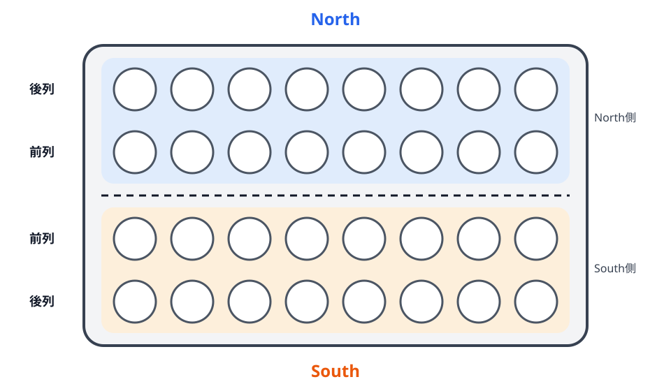
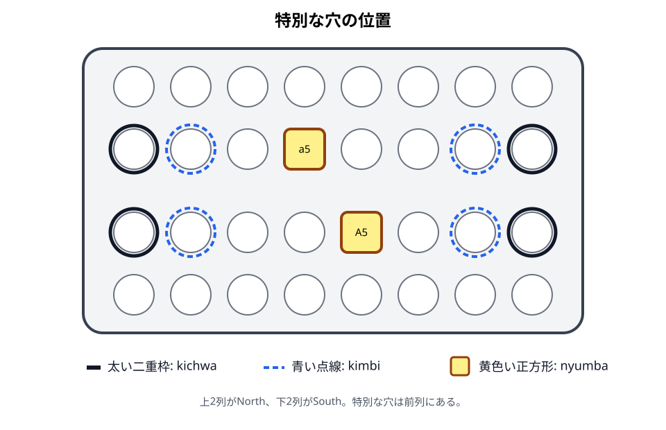

# 盤と用具

## 初心者向け説明

Bao盤には、横8穴の列が4列あります。向かい合う2人が、手前の2列ずつを受け持ちます。中央で向かい合う列が「前列」、盤の外側にある列が「後列」です。

## 用具

- Bao盤: 4列×8穴、合計32穴
- kete: 64個
- プレイヤー: 2人

穴はスワヒリ語で、単数を`shimo`、複数を`mashimo`といいます。駒は`kete`と呼びます。keteは全個体を同じものとして扱い、所有者別に色分けする必要はありません。

## 各プレイヤーの領域

各プレイヤーは自分の前列と後列だけにketeを蒔きます。蒔きは2列の外周を回るように進みます。自分の前列の端から先へ進むと自分の後列へ移り、後列の端から前列へ戻ります。

本書の図では、下側のプレイヤーをSouth、上側をNorthとします。Southの前列を`A`、後列を`B`、Northの前列を`a`、後列を`b`と表します。穴番号は、それぞれの所有者から見て左から右へ1〜8です。North側は紙面上の見た目と番号の進み方が逆になります。そのため、真向かいの前列穴は同じ番号ではなく、`A1`と`a8`、`A2`と`a7`、……、`A8`と`a1`のように対応します。

## 特別な穴

- `nyumba`: 各プレイヤーから見て前列の左から5番目の穴です。SouthはA5、Northはa5です。
- `kichwa`: 各前列の左右端です。A1・A8・a1・a8です。
- `kimbi`: 各前列でkichwaの隣にある穴です。A2・A7・a2・a7です。

kichwaとkimbiは、捕獲したketeをどちら側から蒔き始めるかに関係します。nyumbaは、所有中だけ特別な停止・開始規則を持ちます。

## 注意点

- 「右」「左」は、つねに手番プレイヤー本人から見た向きで判断します。
- 前列は盤の中央側です。自分の身体に近い列は後列です。
- 盤に大きな四角い穴や貯蔵部があっても、それが自動的にnyumbaとは限りません。nyumbaは前列の所定位置です。
- 64個のketeのうち、初めは44個を盤外の手元に置きます。捕獲済みのketeを保管する場所ではありません。

## 地域差・確認メモ

資料によってkichwaを`kitchwa`と綴る例があります。本書では`kichwa`に統一します。また、kichwaをkimbiの一部として広く説明する用法もありますが、本書の盤面説明では端の穴をkichwa、その隣をkimbiとして区別します。

根拠: R-002, pp. 163–164、R-003, Issue 4, p. 21。

前章: [Bao la Kiswahiliとは](01-introduction.md)／次章: [初期配置](03-setup.md)
