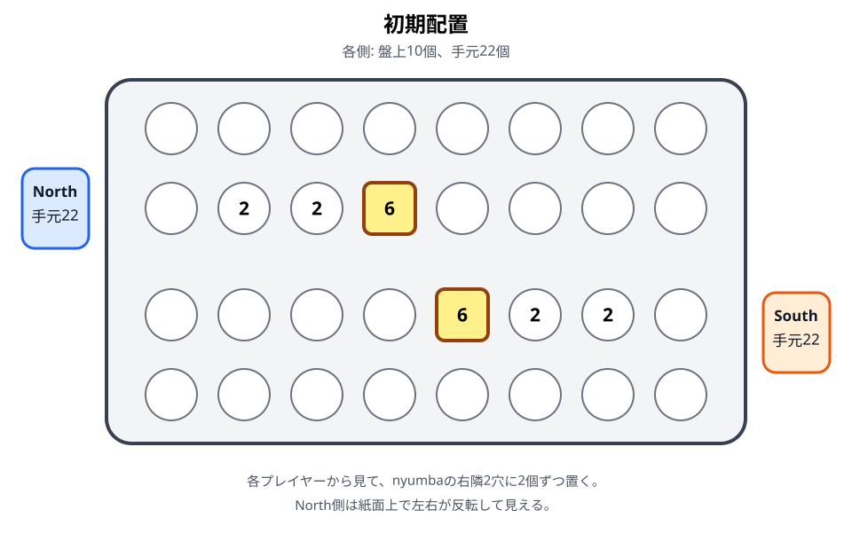

# 初期配置

## この章の目的

Bao la Kiswahili（ザンジバル版）の開始局面を、盤面図と手順で再現できるようにする。

- 対象読者: 対局を準備する読者
- 扱う範囲: 開始時の配置と先手。namua開始後の進行は扱わない

## 構成案

- 使用するketeの総数
- 各プレイヤーのnyumbaと右隣2穴への配置
- 手元に残すkete
- 先手の扱い
- 配置の左右を間違えない確認方法
- 他地域・簡略版との違い

## 執筆時の確認

初期配置の根拠は[ザンジバル版ルール基準調査](../docs/drafts/zanzibar-rules-baseline.md)の対応表からたどる。[Bao la kujifunza](11-kujifunza.md)の配置は別章に分離する。

North側は紙面上では左右が反転して見える。配置するときは、各プレイヤー本人から見た右を基準にする。

前章: [盤と用具](02-board.md)／次章: [用語辞典](04-glossary.md)
