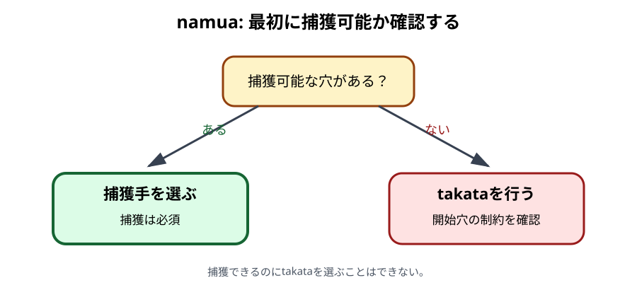

# namua

## 初心者向け説明

namuaは、各プレイヤーが手元に22個のketeを持って始める前半段階です。自分の手番では、まず手元から1個を自分の前列へ入れます。ただし、どの穴へ入れてもよいわけではありません。最初に捕獲できるかを調べ、できるなら必ず捕獲します。

## 合法手を選ぶ順序

手番では次の順に確認します。

1. 自分の前列で、keteが1個以上ある穴を探します。
2. その真向かいにある相手の前列穴にもketeがあれば、その組は捕獲候補です。
3. 捕獲候補が1つでもあれば、そのうち1つから捕獲手を行います。
4. 捕獲候補がなければ、takataを行います。

### 捕獲手

1. 手元から1個を捕獲に使う自分の前列穴へ入れます。
2. 真向かいの相手穴にあるketeをすべて取ります。
3. 取ったketeを、自分の左または右のkichwaから蒔きます。
4. 蒔き終わりに応じて、捕獲またはrelay sowingを続けます。

捕獲穴がkichwaまたはkimbiなら、同じ側のkichwaから蒔き始めます。それ以外の穴なら、namuaの最初の捕獲では左右どちらのkichwaから始めるかを選べます。詳しくは[捕獲](07-capture.md)を参照してください。

### 捕獲できないときのtakata

takataでは、手元から1個を、自分の前列にある占有穴へ入れます。その穴のketeをまとめて取り、左または右へ蒔きます。この手の途中では、捕獲できる形で蒔き終えても捕獲しません。方向を変えずにrelay sowingを続けます。

開始穴には次の制約があります。

- 後列からは始められません。
- 原則として、1個だけの穴からは始められません。
- ただし、前列に2個以上の穴がない場合、またはnyumbaをまだ所有している場合は、1個だけの穴から始められます。
- 6個以上ある所有中のnyumbaからは、原則として始められません。
- 前列で所有中のnyumbaだけが占有されている場合は、nyumbaの例外を使います。

## nyumbaだけが前列に残った場合

所有中のnyumbaだけが自分の前列に残っているときは、手元の1個をnyumbaへ入れた後、nyumbaから2個だけを取り出して左右どちらかへ蒔きます。全内容を取るのではありません。詳しくは[nyumba](09-nyumba.md)を参照してください。

## 具体例

自分の前列A4に2個、真向かいのa4に3個あるとします。A4は捕獲可能穴です。

1. 手元から1個をA4へ入れ、A4を3個にします。
2. a4の3個をすべて取ります。
3. A4はkichwaでもkimbiでもないため、左右どちらのkichwaから蒔くか選びます。
4. 選んだkichwaから3個を1個ずつ蒔き、その終点を判定します。

ほかにtakataをしたい穴があっても、この局面では捕獲が義務です。

## namuaの終了

自分の手元が空になっても、相手に手元のketeが残っていれば、その相手はnamuaの手を続けます。両者の手元がすべて空になった時点でmtajiへ移ります。R-002の初期配置では、終局しなければ各プレイヤー22手、合計44手番で移行します。

## 注意点

- 手元の1個を空穴へ直接置いて手を始めることはできません。
- 捕獲可能かどうかは、自分と相手の前列だけで判定します。
- takataは「最初だけ非捕獲」ではありません。その手の全体が非捕獲です。
- 左右のkichwaを選べるのは、namuaの最初の捕獲穴がkichwa・kimbi以外の場合です。手の途中では既存の方向を維持します。
- 前列にkichwaだけが残る場合、そのkichwaから後列へ向かう方向を選ぶと前列が空になり敗北するため、その方向は選べません。

## 地域差・確認メモ

R-002とR-003は非捕獲手を`takasa`と呼びます。本書では`takata`に統一します。1個だけの穴とnyumbaに関する制約はR-003 Issue 5でIssue 4の説明が補足・訂正されているため、Issue 5を優先しました。

根拠: R-002, pp. 165–167、R-003, Issue 4, pp. 21–22およびIssue 5, pp. 22–23。

関連例: [E05〜E14 namua](examples/README.md#namua)

前章: [用語辞典](04-glossary.md)／次章: [mtaji](06-mtaji.md)
