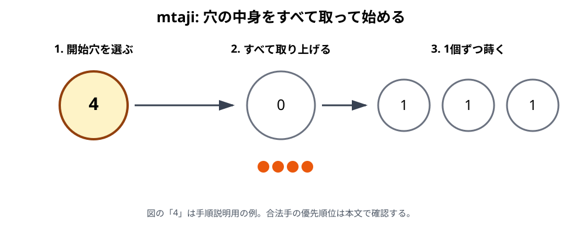

# mtaji

## 初心者向け説明

mtajiは、両者の手元にketeがなくなり、64個すべてが盤上へ入った後半段階です。namuaのように手元から1個を加えません。自分の穴を1つ選び、その中のketeをすべて取って蒔き始めます。

## 合法手を選ぶ順序

1. 2個以上のketeがある自分の穴から、最初の蒔きで捕獲できる手を探します。
2. 捕獲手が1つでもあれば、必ずそのうち1つを選びます。
3. 捕獲手がなければ、takataを行います。
4. takataは、可能なら前列の穴から始めます。前列から合法に始められない場合に後列を使います。

空穴や1個だけの穴から手を始めることはできません。自分の16穴がすべて0個または1個なら、合法手がなく敗北します。

## 捕獲手

捕獲手は、次の条件をすべて満たす開始穴と方向から選びます。

- 自分の前列または後列にある穴である。
- その穴に2個以上15個以下のketeがある。
- 全keteを選んだ方向へ蒔くと、最後の1個が自分の占有された前列穴へ入る。
- その真向かいの相手前列穴にもketeがある。

最後の条件を満たしたら、相手穴の全keteを取り、自分のkichwaから蒔きます。蒔き始める側は、それまでの方向と、捕獲穴がkichwa・kimbiかどうかで決まります。

## 捕獲できないときのtakata

捕獲手がない場合は、2個以上ある穴の中身をすべて取り、選んだ方向へ蒔きます。可能なら前列から開始しなければなりません。takataの途中では捕獲を行わず、停止条件に達するまで同じ方向へrelay sowingを続けます。

前列で占有されている穴がkichwaだけの場合、そのkichwaを空にして前列が空になる方向は選べません。

## 16個以上ある穴

R-001, p. 38とR-002は、捕獲手の開始穴を2〜15個に限定しています。16個以上の穴は「最初の蒔きで捕獲する手」の開始穴にはなりません。一方、捕獲手がなくtakataを行う場合は、前列優先などの条件を満たせば16個以上の穴からも始められます。R-001, p. 41の非捕獲手には、捕獲手の15個上限を適用しません。

2026-10-08に原典を照合しました。16個を蒔く左右両方向の全手順は、[64個の構成局面 V01](examples/validation-cases.md#v01-16個の穴から始めるtakata)で確認できます。

## takasia

takasiaは、mtajiで相手の次のtakataに制約を与える規則です。本書では2026-10-08に、R-001の原典とR-006の著者解説を照合して正式採用しました。

自分のtakataを終えた盤面で、次の2条件を確認します。

1. 相手に捕獲手がなく、次の手がtakataになる。
2. 同じ盤面で自分がもう一度手を指すと仮定すると、最初の蒔きで捕獲できる相手前列穴がちょうど1つである。

数えるのは「捕獲手の数」ではなく「捕獲対象の穴の数」です。開始穴や方向が異なる複数の手でも、対象が同じ穴だけなら2番目の条件を満たします。相手の応手後の盤面を先読みして成立を判定するのではありません。

ただし、次の穴にはtakasiaを適用できません。

- keteが1個だけの穴
- 相手の前列で唯一占有されている穴
- 相手の前列で唯一2個以上ある穴
- 所有状態が残っているnyumba（所有を失った同じ位置の穴は通常穴として判定する）

例外に当たらなければ、その穴を相手の次の1手の間だけtakasiaの対象にします。相手はそこから蒔き始めたり、relay sowingで中身を取り上げたりできません。蒔きの最後の1個が対象穴へ入ったら、そこで必ず手を止めます。途中で通過するだけなら、通常どおり1個を加えて蒔き続けます。

相手が自分のnyumbaから蒔き始めた場合も、最後の1個が対象穴へ入れば停止します。この開始方法による例外は採用しません。対象穴が永久に使用不能になるわけではありません。

成立判定、直前のtakata、相手の全4応手は[完全局面 E30](examples/README.md#e30-takasia対象穴でrelay-sowingを止める)で確認できます。

## 具体例

自分の穴に4個あり、選んだ方向へ4個蒔いた最後の1個が、自分の前列の占有穴へ入るとします。真向かいの相手前列にもketeがあれば、これは捕獲手の候補です。同じ局面に捕獲できない前列の穴があっても、そちらからtakataを始めることはできません。

## 注意点

- mtajiでは手元からketeを追加しません。
- 「2個以上ある穴ならどれでもよい」ではなく、捕獲手を先に全体から探します。
- 捕獲手は前列だけでなく、後列から始めた蒔きでも成立し得ます。
- 捕獲手の開始条件「2〜15個」を、takataの開始条件へ転用しません。
- takasiaは相手の次のtakataへの制約です。蒔きの途中の通過と、最後の1個の到達を区別します。

## 地域差・確認メモ

takasiaの「1個だけの穴は対象にしない」という例外は、R-006, p. 25の著者解説で明記されています。R-001とR-002の例外一覧には同じ明示がないため、後年の補足として採用します。R-001, pp. 42–43にはnyumbaから始めた蒔きなら対象穴で継続できるという異説も記録されていますが、同書の競技者による否定と、R-006・R-002の停止規則に従い、本書では継続を認めません。資料差と採用理由は[採用記録](../docs/drafts/takasia-adoption-20261008.md)に残します。現在のすべての地域・大会で共通するとの主張ではありません。

16個以上の開始穴、前列優先、両列が0個・1個だけの場合の敗北は、R-001, pp. 38, 40–41と照合済みです。現在の大会すべてに共通するとの主張ではありません。

根拠: R-001, pp. 38–41、R-002, pp. 167–168。mtajiの骨格はR-003, Issue 4, p. 22でも確認。

takasiaの根拠: R-001, pp. 41–43、R-006, p. 25、R-002, p. 167, §4.1(a–c)。完全局面はR-009, §4.5。

関連例: [E15〜E22 mtaji](examples/README.md#mtaji)

前章: [namua](05-namua.md)／次章: [捕獲](07-capture.md)
