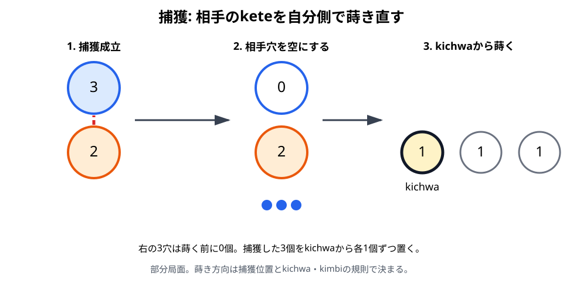
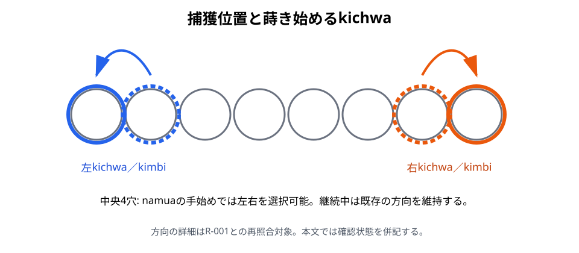

# 捕獲

## 初心者向け説明

Bao la Kiswahiliの捕獲は、相手のketeを盤外へ除く操作ではありません。相手の前列穴を空にし、そこにあった全keteを自分側へ移して、直ちに蒔きます。

捕獲できる手があれば、捕獲は義務です。ただし、捕獲から始まらないtakataの途中では捕獲しません。

## 捕獲が成立する基本条件

蒔きの最後の1個が自分の前列の占有穴へ入り、その真向かいにある相手の前列穴も占有されていれば捕獲が成立します。「占有穴」は、蒔く前からketeがあり、最後の1個を置いた後に2個以上になる穴です。

namuaの手の開始時だけは、手元の1個を自分の占有された前列穴へ直接入れることで、この条件を作ります。mtajiでは開始穴の全keteを蒔いた終点で判定します。

## 捕獲の手順

1. 捕獲穴の真向かいにある相手の前列穴を確認します。
2. その相手穴からketeをすべて取ります。
3. 左右どちらから蒔くかを、下記の方向規則で決めます。
4. 決まった側のkichwaへ最初の1個を置きます。
5. 残りを自分の2列へ1個ずつ蒔きます。
6. 蒔き終わりの穴を判定し、捕獲、relay sowing、または手の終了へ進みます。

## kichwa・kimbiと方向

- 捕獲穴が左のkichwaまたは左のkimbiなら、左のkichwaから蒔き始めます。
- 捕獲穴が右のkichwaまたは右のkimbiなら、右のkichwaから蒔き始めます。
- namuaの最初の捕獲で、捕獲穴がkichwa・kimbi以外なら、左右を選べます。
- それ以外の捕獲では、手の中ですでに進んでいた方向を維持します。

左のkichwaから始める蒔きは時計回り、右のkichwaから始める蒔きは反時計回りです。ここでいう左右は、手番プレイヤー本人から見た向きです。

## 連続捕獲

捕獲したketeを蒔き終えた先でも捕獲条件を満たせば、同じ手の中で再び相手穴を捕獲します。捕獲穴がkichwaまたはkimbiなら、その側のkichwaから蒔き直すため、手の進行方向が変わることがあります。それ以外の穴での捕獲は、既存の方向を維持します。

## 具体例

namuaで、中央寄りの前列穴に自分と相手のketeが向かい合っているとします。

1. 手元から1個を自分の穴へ入れます。
2. 相手穴の全keteを取ります。
3. 捕獲穴がkichwa・kimbi以外なら、左右どちらのkichwaから始めるか選びます。
4. 捕獲したketeを蒔きます。
5. 終点が別の捕獲可能穴なら、続けて捕獲します。

## 注意点

- 相手の後列からは捕獲しません。
- 真向かいの相手前列穴が空なら捕獲できません。
- 自分の終点が空穴なら、keteを置いた後に1個だけなので捕獲できません。
- 捕獲したketeを手元へ戻したり、得点として盤外へ保管したりしません。
- takataの途中では、盤面が捕獲可能な形になっても捕獲しません。

## 地域差・確認メモ

捕獲義務と方向規則の骨格はR-002とR-003で一致します。図7-2はR-002の形式規則に基づいていますが、具体局面を用いたR-001との再照合は未完了です。

根拠: R-002, pp. 164–167、R-003, Issue 4, pp. 21–22。

関連例: [E23〜E25 捕獲方向](examples/README.md#捕獲方向)

前章: [mtaji](06-mtaji.md)／次章: [relay sowing](08-relay-sowing.md)
