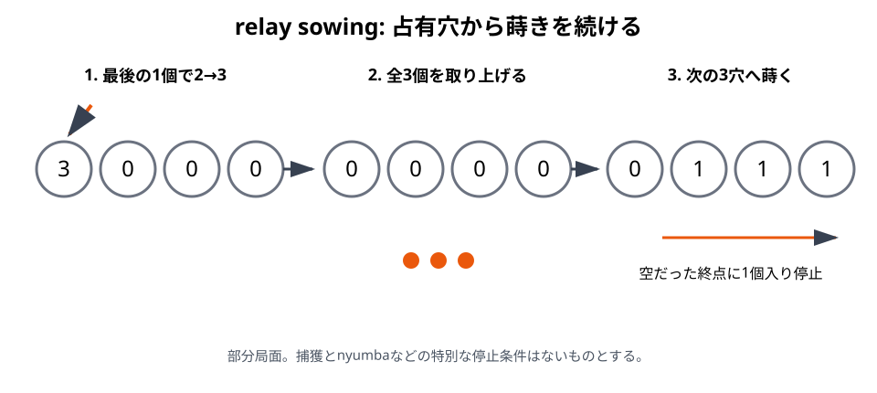
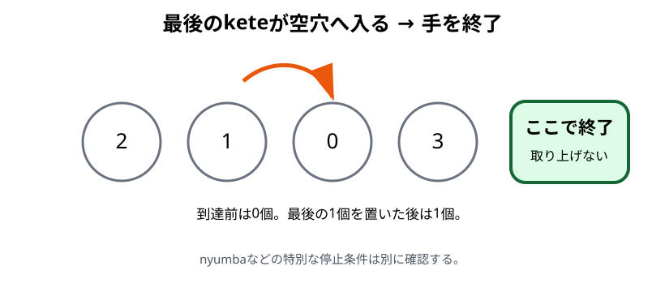

# relay sowing

## 初心者向け説明

1回蒔いて終わりとは限らないことが、Bao la Kiswahiliの大きな特徴です。最後のketeが、すでにketeのある穴へ入った場合、その穴の全keteを取り上げて蒔きを続けます。本書ではこの仕組みを`relay sowing`と呼びます。R-002では継続を`endelea`と呼びます。

## 基本手順

1. 所定のketeを、選んだ方向へ1個ずつ蒔きます。
2. 最後の1個を置いた穴を確認します。
3. その穴が空だったなら、通常は手を終了します。
4. その穴に元からketeがあり、捕獲が起きないなら、穴の全keteを取ります。
5. 同じ方向の次の穴から、1個ずつ蒔き続けます。

「占有穴へ終わる」とは、最後の1個を置いた後に2個以上になったことを指します。空穴へ最後の1個を置いた場合は、置いた後に1個だけなので継続しません。

## 捕獲との関係

捕獲手の途中で、最後のketeが自分の占有された前列穴へ入り、真向かいの相手前列穴にもketeがあれば、relay sowingより先に捕獲します。捕獲したketeをkichwaから蒔き、その終点を改めて判定します。

takataは手全体が非捕獲です。takataの途中で同じ盤面条件が生じても捕獲せず、通常のrelay sowingとして続けます。

## 方向

通常のrelay sowingでは、手を始めたときの方向を維持します。毎回方向を選び直すことはできません。捕獲穴がkichwaまたはkimbiだった場合は、捕獲したketeを同じ側のkichwaから蒔くため、結果として方向が変わることがあります。

## 停止条件

手は次の場合に止まります。

- 最後のketeが空穴へ入った。
- 所有中のnyumbaへ到達し、nyumbaの規則によって止まった。
- mtajiで、相手のtakasiaによる制約があるtakataの最後の1個が対象穴へ入った。
- 手の途中で相手の前列が空になり、ゲームそのものが終了した。

捕獲条件を満たした場合は手を止めず、捕獲処理へ移ります。

## 具体例

3個を蒔き、最後の1個が元から2個ある穴へ入ったとします。その穴は3個になります。捕獲条件や特別な停止条件がなければ、3個すべてを取り、同じ方向の次の穴から蒔きます。次の蒔きが空穴で終われば、そこで手が終わります。

## 注意点

- 最後の穴に置いたketeだけでなく、その穴の全keteを取り上げます。
- 取り上げた穴の次の穴から蒔きます。同じ穴へ最初の1個を戻しません。
- 空穴、所有中のnyumba、takasiaでは通常則と異なる停止が起こります。
- takasiaの対象穴を蒔きの途中で通過するだけなら停止しません。nyumbaから始めた蒔きでも、最後の1個が対象穴へ入れば停止します。制約は次の相手の1手だけです（R-001, p. 42、R-006, p. 25）。[成立条件と例外](06-mtaji.md#takasia)、[完全局面 E30](examples/README.md#e30-takasia対象穴でrelay-sowingを止める)も参照してください。
- 長い手でも、途中で相手へ手番を渡しません。

## 地域差・確認メモ

R-002には、所定数を超えてketeを蒔く手を「終わらない手」とみなして不合法にする計算機専用規則があります。本書はこれを対人競技の正式ルールとして採用しません。終わらない連続蒔き自体はR-004の研究対象ですが、対人対局での処理は未確認です。

根拠: R-002, pp. 164–165、R-003, Issue 4, pp. 21–22。終わらない手はR-004。

関連例: [E26〜E28 relay sowingとtakata](examples/README.md#relay-sowingとtakata)

前章: [捕獲](07-capture.md)／次章: [nyumba](09-nyumba.md)
