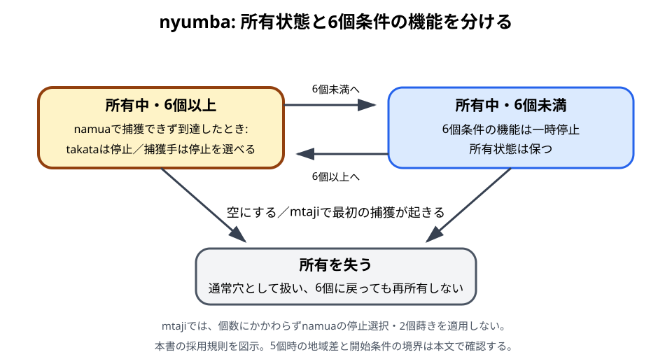
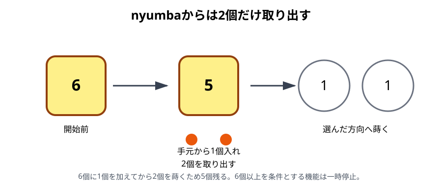

# nyumba

## 初心者向け説明

nyumbaは、各プレイヤーの前列に1つずつある特別な穴です。初期配置で6個のketeを入れ、「所有している」状態から始めます。所有中だけ、通常のrelay sowingとは異なる停止や開始を選べます。

nyumbaは場所の名前であると同時に、特別な機能を持つ状態でもあります。特別な機能を失った後も穴そのものは残りますが、通常の前列穴として扱います。

## 位置と初期状態

nyumbaは、各プレイヤー本人から見て前列の左から5番目にあります。SouthはA5、Northはa5です。初期配置では6個入り、両者がそれぞれ自分のnyumbaを所有します。

## namuaでnyumbaへ到達したとき

所有中のnyumbaへ蒔き終わった場合は、手の種類によって扱いが変わります。

### takataの場合

nyumbaが6個以上になったなら、そこで手を止めます。全keteを取り上げてrelay sowingを続けません。

### 捕獲手の場合

nyumbaの真向かいから捕獲できるなら、通常どおり捕獲します。捕獲できない場合は、そこで止めるか、nyumbaを「使う」かを選べます。

nyumbaを使う場合は、中の全keteを取り上げ、同じ手の方向へ蒔き続けます。nyumbaを空にした時点で所有状態を失います。

## nyumbaからの2個蒔き

namuaで捕獲できず、自分の前列で所有中のnyumbaだけが占有されている場合に使う開始方法です。

1. 手元から1個をnyumbaへ入れます。
2. nyumbaから2個だけを取り出します。
3. 左右どちらかを選び、1個ずつ蒔きます。

この操作ではnyumbaを空にしません。7個から2個を蒔くと5個残るため、6個以上を条件とする特別な停止規則は働かなくなります。R-002とR-008では、nyumbaを失ったとはせず、再び6個以上になれば条件付きの機能が戻ります。R-003 Issue 5は、6個未満の穴を機能するnyumbaとは呼びません。英語資料で`taxation`と呼ばれることがありますが、本書では「nyumbaからの2個蒔き」と説明します。

## 所有状態を失う条件

R-002の形式規則とR-008では、次の場合にnyumbaの所有状態を失います。

- nyumbaの中身をすべて取り、空にした。
- mtajiに入った後、最初の捕獲が起きた。

mtaji開始時にまだ所有していれば、最初の捕獲までは所有状態が残ります。この持ち越しはR-001, p. 42とR-006, p. 25でも確認でき、所有中のnyumbaはtakasiaの対象になりません。所有を失った後は、その位置の穴も通常穴としてtakasiaを判定します。ただし、namuaにおけるnyumbaからの2個蒔きや、nyumbaで止まる選択はmtajiでは適用しません。

nyumbaから蒔き始めたことによるtakasiaの停止免除は認めません。蒔きの最後の1個が別のtakasia対象穴へ入った場合は停止します。[mtajiの採用規則](06-mtaji.md#takasia)を参照してください。

相手にnyumbaの真向かいから捕獲されて空になった場合も、「空になった」ため特別な機能を失います。

## 具体例

捕獲手のrelay sowingが、所有中で6個以上ある自分のnyumbaへ到達し、真向かいの相手穴が空だったとします。この場合は次の2択です。

- nyumbaで手を止め、所有状態を保つ。
- nyumbaの全keteを取り上げて同じ方向へ蒔き、所有状態を失う。

同じ到達でもtakataなら、6個以上の所有中nyumbaで停止し、続行を選びません。

## 注意点

- 盤上のnyumbaは、所有状態を失っても位置が変わりません。
- 所有中のnyumbaへ、いつでも手元の1個を入れられるわけではありません。
- 2個蒔きは全内容を蒔く操作ではなく、namuaの限定された開始規則です。
- 捕獲手でnyumbaに到達しても、真向かいに相手のketeがあれば停止を選ばず捕獲します。
- mtajiではnamuaのnyumba例外をそのまま使いません。

## 資料差・確認メモ

R-002とR-008は、nyumbaの「所有状態」と、6個以上のときに働く特別な機能を区別できます。6個未満では6個以上を条件とする規則が一時停止し、再び6個以上になれば適用されます。所有中のnyumbaはmtajiへ残り、最初の捕獲まで状態を保つ場合があります。

一方、R-003 Issue 5は「機能するnyumba」を手元が残り、かつ6個以上ある場合に限ると説明し、mtajiにはnyumbaが存在しないとします。6個未満の時点で特別な機能が働かない点は共通しますが、機能の再開とmtajiへの持ち越しには資料差があります。2026-10-08のtakasia調査では、R-001・R-006にもmtajiへの所有状態の持ち越しがあることを確認しました。6個未満時の扱い全体と現地の運用については、引き続き項目別照合の対象とします。

根拠: R-002, pp. 165–167、R-003, Issue 4, pp. 21–22およびIssue 5, pp. 22–23、R-008, §§3.2, 4.2.1–4.2.3。

takasiaと所有状態の持ち越し: R-001, pp. 42–43、R-006, p. 25。

関連例: [E29 nyumba](examples/README.md#e29-namuaの捕獲手が所有中nyumbaへ到達する)

前章: [relay sowing](08-relay-sowing.md)／次章: [終局と勝敗](10-endgame.md)
