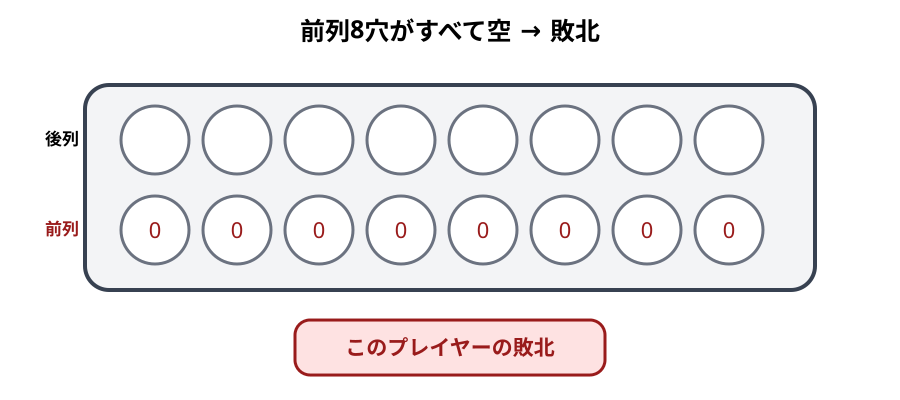

# 終局と勝敗

## 初心者向け説明

Bao la Kiswahiliでは、相手の前列8穴をすべて空にすると勝ちです。また、相手が合法手を行えない場合も勝ちます。keteの総数を比べて勝敗を決めるゲームではありません。

## 終局条件

R-002の形式規則では、次のどちらかが起きるとゲームを終了します。

1. 一方のプレイヤーの前列がすべて空になった。
2. 手番プレイヤーに合法手がない。

どちらの場合も、条件を満たした側が敗者、相手が勝者です。

## 手の途中で前列が空になった場合

前列が空になる条件は、手の終了時だけでなく手の途中でも判定します。捕獲によって相手の前列最後のketeを取り去ったなら、その時点でゲームが終了します。捕獲したketeを最後まで蒔いてから判定するのではありません。

また、自分の前列最後の占有穴から蒔き始めて一時的に前列を空にする方向は、敗北につながります。R-002は、前列にkichwaだけが残る場合、前列を空にして後列へ向かうtakataを禁止しています。

## 合法手がない場合

mtajiでは、空穴と1個だけの穴から手を始められません。自分の前列・後列の全16穴が0個または1個なら合法手がなく、敗北します。

namuaでは手元から1個を使いますが、前列の状態と開始制約に従う必要があります。R-002は一般条件として「動けないプレイヤーの敗北」を定めています。

## 具体例

相手前列にketeがある穴が1つだけ残っているとします。自分がその真向かいで捕獲し、相手穴の全keteを取ると、相手前列は空になります。relay sowingが続く形でも、その時点で終局です。

別の例として、mtajiで自分の16穴すべてに0個または1個しかない場合、2個以上の開始穴がありません。相手前列にketeが残っていても、合法手なしで敗北します。

## 投了

R-002には棋譜例で投了が記録されています。勝ち目がないと判断したプレイヤーが投了すれば、相手の勝ちとして対局を終えられます。投了の宣言方法は、大会や対局者間の取り決めに従ってください。

## 引き分けと終わらない手

今回確認した基準資料には、通常の引き分け条件を確定できる記述がありません。R-002は終わらない手を不合法とし、有限手がなければ敗北とする規則を置いていますが、明示的に計算機用の特則です。

したがって、本書は「一定回数を超えたら引き分け」「終わらない手なら自動的に敗北」といった処理を、対人競技の正式ルールとして採用しません。該当局面では棋譜を残し、採用する競技規則または裁定者に従ってください。

## 注意点

- 盤上や手元のkete数の多さだけでは勝敗を決めません。
- 相手の後列が空でも、それだけでは勝ちになりません。
- 前列空は手の途中でも判定します。
- 「合法手なし」と「捕獲手なし」は別です。捕獲できなくてもtakataが可能ならゲームは続きます。

## 地域差・確認メモ

相手前列を空にする勝利条件はR-002とR-003で一致しています。合法手なしはR-002で明示されています。投了、引き分け、終わらない手の対人運用は、R-001本文または現行の競技規則との照合が必要です。

根拠: R-002, pp. 164–168、R-003, Issue 4, p. 21。終わらない手はR-004も参照。

関連例: [E31〜E32 終局](examples/README.md#nyumbatakasia終局)

前章: [nyumba](09-nyumba.md)／次章: [Bao la kujifunza](11-kujifunza.md)
